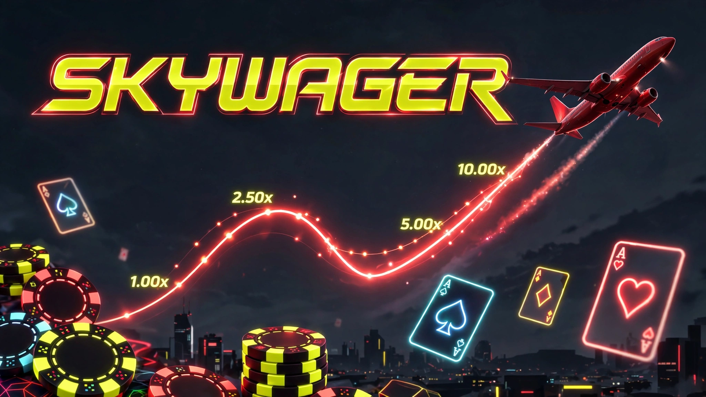

<div align="center">

# ✈️ SkyWager


**A complete online casino front-end demo in a single HTML file — dark dashboard UI with a fully playable Aviator-style crash game rendered on canvas. No backend, no build step.**

</div>

---

## 📸 Preview



## ✨ Features

- **Auth system** — login / register with client-side validation, session persistence, and mock social (Google / Facebook) sign-in, all stored in `localStorage`
- **Casino dashboard** — sidebar navigation, topbar with balance (Rs.) and wallet controls
- **Home page** — promo banner, scrolling winners ticker, featured Aviator card, and popular-games + slots grids
- **Aviator crash game (canvas)**:
  - ✈️ Animated plane with glowing trail and rising multiplier
  - 🎯 Dual bet panels with quick amounts and presets
  - 💸 Cash-out before the plane flies away
  - 📊 Live bets feed, round-history pills, and waiting-round countdown
  - 🔔 Toast notifications for wins, losses, and info
- **Balance engine** — starting balance of Rs. 1,000, wins and losses tracked in-session

## 🛠 Tech Stack

| Technology | Role |
|---|---|
| HTML5 | Structure (single `index.html`) |
| CSS3 | All styling — dark theme, animations, responsive panels |
| Vanilla JavaScript | Game engine, canvas rendering, auth, state |
| localStorage | User accounts + session persistence |
| Canvas 2D | Aviator game rendering |

## 🚀 Getting Started

No install, no build — just open it:

```bash
# clone
git clone https://github.com/hussnainahmedd/Sky-Wager.git
cd Sky-Wager

# open index.html in any modern browser
```

Or serve it locally for a clean origin:

```bash
python3 -m http.server 8080
# then visit http://localhost:8080
```

**To play:** register a local account (or use mock social login) — you start with Rs. 1,000. Head to the Aviator tab, place a bet, and cash out before the plane flies away.

> 📝 This is a front-end demo: accounts, balances, and the crash engine are all simulated in the browser. Nothing here connects to a real backend or real-money system.

---

<div align="center">

Built by **[Hussnain Ahmad](https://github.com/hussnainahmedd)** — learning by building. 🎰

</div>
